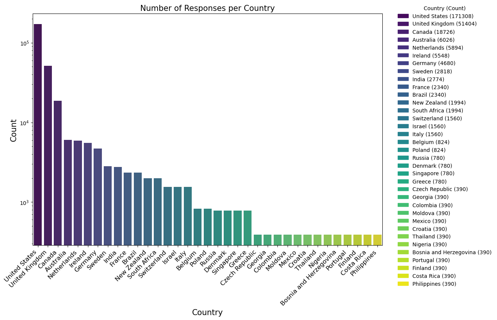
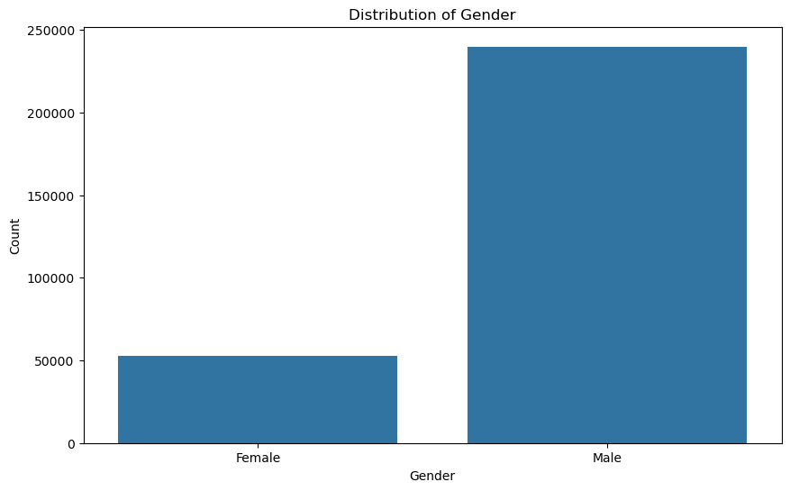
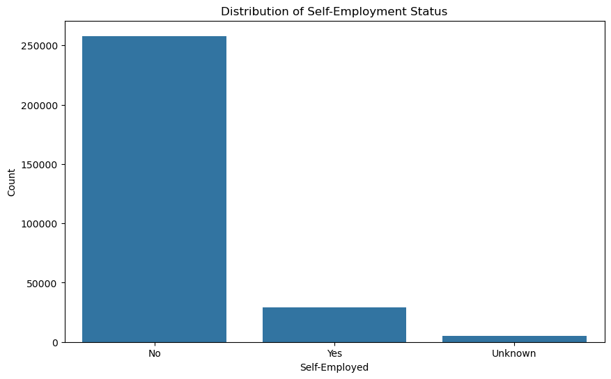
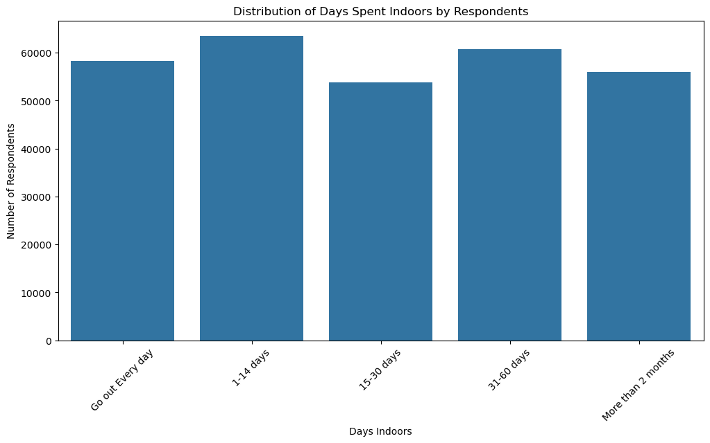
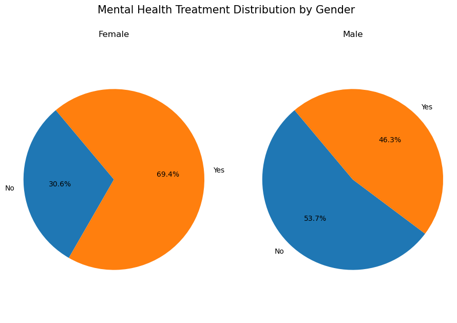
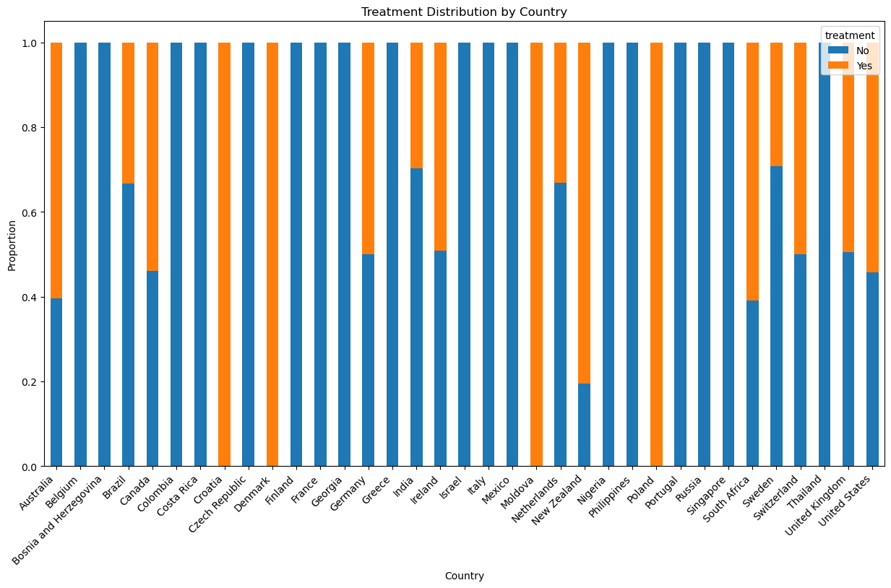

# Mental Health Analysis Project

## Overview
This project analyzes mental health trends, symptoms, and care-seeking behavior using a dataset sourced from Kaggle, curated by Bhavik Jikadara. The dataset encompasses responses from individuals worldwide, offering valuable insights into various mental health conditions, their perceived causes, and the demographics of those affected. By leveraging this dataset, the project aims to reveal patterns and correlations that could help organizations, researchers, and mental health professionals understand the prevalence of mental health issues and identify gaps in support systems.

### Key Features

- **Demographic Analysis**: Investigate mental health patterns across different age groups, genders, and regions.
- **Symptom and Condition Insights**: Analyze the prevalence of various symptoms and conditions to understand common mental health issues faced globally.
- **Healthcare Access and Support**: Assess how factors like employment, location, and workplace policies influence access to mental health support and treatment.
- **Data-Driven Visualizations**: Display meaningful trends and findings through interactive and intuitive visualizations.

### Project Goals

- **Identify** patterns in mental health conditions and symptoms.
- **Explore** correlations between demographics and mental health support access.
- **Provide** actionable insights for mental health policy-making and awareness.

---

## Dataset
The dataset includes:
- **Demographic Information**: Age, gender, nationality, and more.
- **Mental Health Conditions**: Conditions such as anxiety, depression, and other common mental health issues.
- **Treatment and Care Access**: Insights into how individuals seek or experience mental health support.

**Dataset Source**: [Kaggle Mental Health Dataset](https://www.kaggle.com/datasets/bhavikjikadara/mental-health-dataset?resource=download)

The dataset used in this project is named `Mental Health Dataset.csv` and contains 292,364 entries with the following columns:

- `Timestamp`: The date and time when the data was recorded.
- `Gender`: The gender of the respondent.
- `Country`: The country of the respondent.
- `Occupation`: The occupation of the respondent.
- `self_employed`: Whether the respondent is self-employed.
- `family_history`: Whether the respondent has a family history of mental health issues.
- `treatment`: Whether the respondent has sought treatment for mental health issues.
- `Days_Indoors`: The number of days the respondent stayed indoors.
- `Growing_Stress`: Whether the respondent has experienced growing stress.
- `Changes_Habits`: Whether the respondent has noticed changes in their habits.
- `Mental_Health_History`: Whether the respondent has a history of mental health issues.
- `Mood_Swings`: Whether the respondent experiences mood swings.
- `Coping_Struggles`: Whether the respondent struggles with coping.
- `Work_Interest`: Whether the respondent has an interest in work.
- `Social_Weakness`: Whether the respondent experiences social weakness.
- `mental_health_interview`: Whether the respondent has had a mental health interview.
- `care_options`: The care options available to the respondent.
---
### Data Loading and Initial Exploration

Due to the presence of missing values in the `self_employed` column, it was necessary to address these gaps to ensure the integrity of the analysis. Missing values in this column were filled with the value `"Unknown"`.

## Demographic Overview

These preliminary analyses offer an overview of the key demographic and foundational metrics within the dataset.

### Number of Responses per Country

The bar plot illustrates the number of responses received from each country in the dataset. The y-axis is displayed on a logarithmic scale to accommodate the wide range of response counts across different countries.

The plot reveals that the majority of responses come from the United States, followed by the United Kingdom and Canada. This distribution reflects a significant concentration of data in a few countries, which could influence the representativeness of the findings. Smaller numbers of responses were recorded in other countries, making it essential to consider potential biases when interpreting the data.

The color legend to the right of the plot helps in identifying each country along with the exact number of responses received.

### Gender Distribution
The first step in the exploratory data analysis was to understand the distribution of genders within the dataset. A bar plot was generated to visualize this distribution, as shown below:

The plot shows that there is a significant gender imbalance in the dataset, with the majority of respondents identifying as male. This disparity is important to note as it may influence the outcomes of further analysis, particularly when looking into gender-specific trends or mental health issues.

### Self-employment Distribution

The bar plot shows that the majority of respondents are not self-employed, with over 250,000 indicating this status. Around 30,000 respondents are self-employed, while a small portion, classified as "Unknown", reflects missing data.

This suggests that most participants work in traditional employment rather than being self-employed, which could influence their access to mental health support. The "Unknown" category highlights a limitation due to missing data that may affect analysis accuracy.

### Days Indoors Distribution

The bar chart illustrates how long respondents have stayed indoors:
- `Every day`: Nearly 60,000 respondents.
- `1-14 days`: The most common duration, with around 65,000 respondents.
- `31-60 days`: About 60,000 respondents.
- `15-30 days` and `>2 months`: Both have around 55,000 respondents.

Most respondents stayed indoors for 1-14 days, while nearly 60,000 respondents indicated going out daily. Extended stays of more than 2 months are also significant, suggesting varied impacts on lifestyles and potentially mental health.

## Mental Health Treatment Insights
This section focuses on understanding how different demographics are affected by mental health treatment. It sets the foundation for exploring what factors influence the decision to seek treatment.

### Mental Health Treatment Distribution

In this bar plot, we observe two bars:

- `Yes`: Indicates respondents who have sought treatment for mental health issues.
- `No`: Indicates respondents who have not sought treatment.

This plot shows that there is a nearly even distribution between those who have received treatment and those who have not. This suggests that, while there is a substantial awareness or acceptance of seeking mental health care, a large number of individuals still do not pursue treatment. Further analysis could investigate which factors, such as demographic or occupational status, correlate with the likelihood of seeking treatment.

### Gender Distribution - Mental Health Treatment

- `Female Chart`:
Approximately `69%` of females have sought mental health treatment.
About `31%` have not sought treatment.
This indicates a higher rate of mental health treatment-seeking behavior among females.
- `Male Chart`:
Approximately `46%` of males have sought treatment.
About `54%` have not.
This suggests that a lower proportion of males pursue treatment, which could reflect gender-related stigmas or differing access to mental health support.

The comparison highlights a significant gender gap, with females being more likely to seek mental health treatment than males. This pattern could have implications for targeted mental health support campaigns and resource allocation by gender.

### Treatment Distribution by Country

## Employment and Occupation Factors

###

###

###

