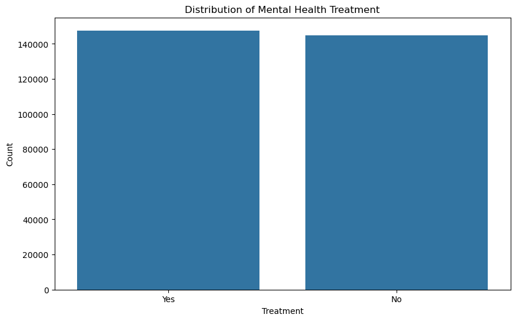

# Mental Health Data Analysis

## Overview

This project analyzes mental health trends, symptoms, and care-seeking behavior using a [dataset sourced from Kaggle, curated by Bhavik Jikadara](https://www.kaggle.com/datasets/bhavikjikadara/mental-health-dataset?resource=download). The dataset encompasses responses from individuals worldwide and was collected between **August 27, 2014, and February 1, 2016**. This period offers valuable insights into various mental health conditions, their perceived causes, and the demographics of those affected.

### Table of Contents

### Implications of Using an Older Dataset

The dataset was chosen for its comprehensive size and the variety of interesting insights it offers, even though the documentation was not highly detailed.

While the data provides significant value in identifying patterns and correlations to aid organizations, researchers, and mental health professionals, it’s essential to consider the implications of its age. Changes in societal attitudes, mental health awareness, and treatment accessibility over time mean that some trends observed may not fully reflect the current state of mental health issues and support systems. Despite this, the dataset remains a vital resource for understanding foundational trends and longstanding gaps in mental health support.

### Key Features

- **Demographic Analysis**: Investigate mental health patterns across different age groups, genders, and regions.
- **Symptom and Condition Insights**: Analyze the prevalence of various symptoms and conditions to understand common mental health issues faced globally.
- **Healthcare Access and Support**: Assess how factors like employment, location, and workplace policies influence access to mental health support and treatment.
- **Data-Driven Visualizations**: Display meaningful trends and findings through interactive and intuitive visualizations.

### Project Goals

- **Identify** patterns in mental health conditions and symptoms.
- **Explore** correlations between demographics and mental health support access.
- **Provide** actionable insights for mental health policy-making and awareness.

---

## Dataset
The dataset includes:
- **Demographic Information**: Age, gender, nationality, and more.
- **Mental Health Conditions**: Conditions such as anxiety, depression, and other common mental health issues.
- **Treatment and Care Access**: Insights into how individuals seek or experience mental health support.

**Dataset Source**: [Kaggle Mental Health Dataset](https://www.kaggle.com/datasets/bhavikjikadara/mental-health-dataset?resource=download)

The dataset used in this project is named `Mental Health Dataset.csv` and contains 292,364 entries with the following columns:

- `Timestamp`: The date and time when the data was recorded.
- `Gender`: The gender of the respondent.
- `Country`: The country of the respondent.
- `Occupation`: The occupation of the respondent.
- `self_employed`: Whether the respondent is self-employed.
- `family_history`: Whether the respondent has a family history of mental health issues.
- `treatment`: Whether the respondent has sought treatment for mental health issues.
- `Days_Indoors`: The number of days the respondent stayed indoors.
- `Growing_Stress`: Whether the respondent has experienced growing stress.
- `Changes_Habits`: Whether the respondent has noticed changes in their habits.
- `Mental_Health_History`: Whether the respondent has a history of mental health issues.
- `Mood_Swings`: Whether the respondent experiences mood swings.
- `Coping_Struggles`: Whether the respondent struggles with coping.
- `Work_Interest`: Whether the respondent has an interest in work.
- `Social_Weakness`: Whether the respondent experiences social weakness.
- `mental_health_interview`: Whether the respondent has had a mental health interview.
- `care_options`: The care options available to the respondent.
---
### Data Loading and Initial Exploration

Due to the presence of missing values in the `self_employed` column, it was necessary to address these gaps to ensure the integrity of the analysis. Missing values in this column were filled with the value `"Unknown"`.

## Demographic Overview

These preliminary analyses offer an overview of the key demographic and foundational metrics within the dataset.

### Number of Responses per Country

The bar plot illustrates the number of responses received from each country in the dataset. The y-axis is displayed on a logarithmic scale to accommodate the wide range of response counts across different countries.

The plot reveals that the majority of responses come from the United States, followed by the United Kingdom and Canada. This distribution reflects a significant concentration of data in a few countries, which could influence the representativeness of the findings. Smaller numbers of responses were recorded in other countries, making it essential to consider potential biases when interpreting the data.

The color legend to the right of the plot helps in identifying each country along with the exact number of responses received.

### Gender Distribution
The first step in the exploratory data analysis was to understand the distribution of genders within the dataset. A bar plot was generated to visualize this distribution, as shown below:

The plot shows that there is a significant gender imbalance in the dataset, with the majority of respondents identifying as male. This disparity is important to note as it may influence the outcome of further analysis, particularly when looking into gender-specific trends or mental health issues.

### Self-employment Distribution

The bar plot shows that the majority of respondents are not self-employed, with over 250,000 indicating this status. Around 30,000 respondents are self-employed, while a small portion, classified as "Unknown", reflects missing data.

This suggests that most participants work in traditional employment rather than being self-employed, which could influence their access to mental health support. The "Unknown" category highlights a limitation due to missing data that may affect analysis accuracy.

### Days Indoors Distribution

The bar chart illustrates how long respondents have stayed indoors:
- `Every day`: Nearly 60,000 respondents.
- `1-14 days`: The most common duration, with around 65,000 respondents.
- `31-60 days`: About 60,000 respondents.
- `15-30 days` and `>2 months`: Both have around 55,000 respondents.

Most respondents stayed indoors for 1-14 days, while nearly 60,000 respondents indicated going out daily. Extended stays of more than 2 months are also significant, suggesting varied impacts on lifestyles and potentially mental health.

## Mental Health Treatment Insights
This section focuses on understanding how different demographics are affected by mental health treatment. It sets the foundation for exploring what factors influence the decision to seek treatment.

### Mental Health Treatment Distribution

In this bar plot, we observe two bars:

- `Yes`: Indicates respondents who have sought treatment for mental health issues.
- `No`: Indicates respondents who have not sought treatment.

This plot shows that there is a nearly even distribution between those who have received treatment and those who have not. This suggests that, while there is a substantial awareness or acceptance of seeking mental health care, a large number of individuals still do not pursue treatment. Further analysis could investigate which factors, such as demographic or occupational status, correlate with the likelihood of seeking treatment.

### Gender Distribution - Mental Health Treatment

- `Female Chart`:
Approximately `69%` of females have tried mental health treatment.
About `31%` have not sought treatment.
This indicates a higher rate of mental health treatment-seeking behavior among females.
- `Male Chart`:
Approximately `46%` of males have sought treatment.
About `54%` have not.
This suggests that a lower proportion of males pursue treatment, which could reflect gender-related stigmas or differing access to mental health support.

The comparison highlights a significant gender gap, with females being more likely to seek mental health treatment than males. This pattern could have implications for targeted mental health support campaigns and resource allocation by gender.

## Employment and Occupation Factors
These analyses dive into how employment status and occupation relate to mental health. The focus is on identifying occupation-related trends that impact treatment and prevalence.

### Relationship between Self-employment and Mental Health Treatment

The bar plot shows the relationship between self-employment status and mental health treatment. Respondents are divided into 3 groups: `No` (not self-employed), `Yes` (self-employed), and `Unknown` (missing data). Each category is split into those who received treatment (blue bar) and those who did not (orange bar).

- `Not Self-Employed`: Most respondents are not self-employed, with a balanced split between those who sought treatment and those who did not. Slightly more received treatment.

- `Self-Employed`: Fewer self-employed individuals sought treatment, suggesting barriers like affordability or lack of benefits.

- `Unknown`: Few respondents fall into this category, indicating limited impact on trends.

The chart suggests that self-employed individuals are less likely to seek treatment, possibly due to affordability or lack of structured support.

### Distribution of Mental Health History by Occupation

The bar plot above illustrates the distribution of mental health history across different occupations, categorized as `Yes` (has mental health history), `No` (does not have), and `Maybe` (uncertain). The occupations include:

`Corporate`: The highest number of respondents marked "Maybe", showing potential uncertainty about mental health issues. A significant number also reported "No" and "Yes" in close proportions.

`Student`: Students report the highest number in the "No" category, with fewer indicating mental health issues, either as "Yes" or "Maybe". This could reflect a lack of awareness or under-reporting among younger individuals.

`Business`: Business professionals reported fewer "Maybe" responses compared to other occupations but have a balanced distribution between "No" and "Yes". 

`Housewife`: Respondents classified as housewives have a notable distribution across all categories, with slightly higher counts in "Maybe" and "No". This suggests varied mental health awareness or challenges that could be linked to social and domestic pressures.

`Others`: The "Others" category shows a diverse attitude mental health landscape with a significant number reporting "Yes". This indicates a wide range of experiences depending on the varied job roles included in this category.

This distribution suggests that occupation can influence both the awareness and acknowledgment of mental health issues, with varied trends across different job roles.

## Environmental and Lifestyle Impacts on Mental Health

This section explores the relationship between environmental and lifestyle factors like time spent indoors, stress, and changes in habits with mental health issues and treatment.

### Relationship Between Days Spent Indoors and Mental Health History

The bar chart shows the relationship between days spent indoors and respondents' mental health history, categorized as `Yes` , `No` and `Maybe`. The categories for days indoors include:

`Go Out Every Day`: **No** leads with ~23,000 respondents, followed by **"Yes"** at ~20,000, and **Maybe** at ~16,000. Suggests fewer mental health challenges for those going out every day.

`1-14 Days Indoors`: **No** has the highest count (~27,000), followed by **"Yes"** (~19,000), and **Maybe** (~18,000). Indicates fewer reported mental health issues for short periods spent indoors.

`15-30 Days Indoors`: **Yes** leads with ~22,000, which indicates increased reported mental health issues. **Maybe** (~16,000) and **No** (~17,000) follow.

`31-60 Days Indoors`: Similar pattern with **Yes** at ~17,000, suggesting longer stays correlate with increased acknowledgment of mental health challenges.

`More than 2 Months Indoors`: **Maybe** leads (~22,000), suggesting potential uncertainty or undiagnosed issues, with **Yes** (~17,000) and **No** (~18,000).

- **Short indoor stays (1-14 days)** show more "No" responses, indicating fewer mental health issues.
- **15-30 days indoors** increased "Yes" responses, implying more recognition of mental health issues.
- **More than a month indoors** have the highest "Maybe" responses, suggesting more uncertainty.

### Coping Struggles by Days Spent Indoors

The bar chart shows the relationship between the number of days respondents spent indoors and their reported coping struggles, categorized as `Yes` (struggled with coping) and `No` (did not struggle). The categories for days spent indoors include:

`Go out Every Day`: **Yes** leads with ~30,000 respondents, while **No** follows closely with ~28,000. This suggests that even when going out daily, many individuals still experience coping challenges.

`1-14 Days Indoors`: **No** has the highest count (~37,000), indicating that most respondents did not struggle during short indoor periods. **Yes** responses are lower, at ~26,000, showing fewer coping issues for short-term indoor stays.

`15-30 Days Indoors`: **No** remains higher at ~31,000, but **Yes** is not far behind at ~24,000. This suggests that staying indoors for up to a month begins to increase coping struggles for more respondents.

`31-60 Days Indoors`: **Yes** surpasses **No** with ~32,000 respondents, compared to **No** at ~30,000. This indicates that this period marks a critical point where more people report struggles compared to those who do not.

`More than 2 Months Indoors`: **No** responses are slightly higher at ~30,000, while **Yes** follows closely at ~27,000. This slight shift suggests that some adaptation may occur over longer periods, though many still struggle.

- **Short indoor durations (up to 14 days)** are associated with fewer coping struggles, as indicated by a significant majority of "No" responses.
- **31-60 days indoors** show the highest number of "Yes" responses, highlighting this period as a peak time for reported coping difficulties.
- **More than 2 months indoors** sees a slight recovery with more "No" responses, potentially indicating adaptation or data nuances that should be verified.

### Relationship Between Growing Stress and Coping Struggles

The bar chart above illustrates the relationship between respondents' experiences of growing stress and their reported coping struggles, categorized as `Yes` (struggled with coping) and `No` (did not struggle). The categories for growing stress responses include:

`Yes (Growing Stress)`: 
- **No (Did not struggle)**: ~52,000 respondents.
- **Yes (Struggled)**: ~47,000 respondents.
- **Observation**: A significant portion of respondents experiencing growing stress still report not struggling to cope, although the numbers are close. This indicates that while growing stress is prevalent, a large number of people manage to cope effectively.

`No (No Growing Stress)`:
- **No**: ~47,000 respondents.
- **Yes**: ~47,000 respondents.
An almost equal number of respondents reported coping and struggling. This suggests that even without growing stress, individuals experience varying levels of coping success, indicating that other factors might be at play.

`Maybe (Uncertain if Growing Stress)`:
- **No**: ~55,000 respondents.
- **Yes**: ~47,000 respondents.
A notable number of respondents who were uncertain about growing stress reported not struggling. However, a significant number did report struggles, implying that uncertainty about stress can still correlate with coping challenges.

### Relationship Between Growing Stress and Mental Health Treatment

The bar chart illustrates the relationship between respondents' experiences of growing stress and whether they have sought mental health treatment, categorized as `Yes` (has received treatment) and `No` (has not received treatment). 

This analysis shows that while growing stress often correlates with seeking treatment, a considerable number of individuals do not pursue mental health care even when experiencing stress. Similarly, the decision to seek treatment among those without or unsure of stress levels indicates that mental health care access may be based on factors beyond current stress perception. 

## Comprehensive Analysis and Correlations

Finally, we bring everything together by examining overall relationships between the different factors and looking for overarching trends. This helps in identifying major influencing elements.

# Correlation Heatmap Interpretation

### General Overview
The correlations between variables are mostly low, indicating that there isn't a strong linear relationship between most of the variables. The color intensity and numerical values help identify where any significant correlations might exist.

**Days_Indoors**:
   - **Growing_Stress (0.046)**: A very weak positive correlation, suggesting that spending more days indoors might be slightly associated with increased stress.
   - **Work_Interest (-0.042)**: A very weak negative correlation, indicating that as days indoors increase, interest in work might slightly decrease.

**Growing_Stress**:
   - **Work_Interest (0.066)**: A slightly positive correlation, implying that an increase in stress could be linked to a slight increase in work interest, but the relationship is weak.
   - **Social_Weakness (0.051)**: A weak positive correlation, suggesting stress might be associated with a minor increase in social weakness.

**Changes_Habits**:
   - Shows weak or negligible correlations with most variables, implying that changes in habits don’t have a significant direct relationship with the other factors.

**Mental_Health_History**:
   - **Work_Interest (0.085)**: A positive, yet weak, correlation, suggesting that individuals with a mental health history might show a slight increase in work interest.
   - **Social_Weakness (-0.092)**: A weak negative correlation, which may suggest that having a mental health history is slightly associated with a decrease in social weakness.

**Mood_Swings**:
   - Generally shows very low correlations with other variables, indicating that mood swings don’t significantly correlate with the other factors in this dataset.

**Coping_Struggles**:
   - **Work_Interest (0.04)**: A very weak positive correlation, indicating that struggles with coping might have a minimal link with work interest.
   - Very weak correlations with other variables imply little to no significant relationships.

**Work_Interest**:
   - Shows weak positive and negative correlations with most variables, indicating that work interest is only slightly influenced by the other factors in the dataset.

**Social_Weakness**:
   - Has weak correlations with other variables, but **Mental_Health_History (-0.092)** and **Mood_Swings (-0.089)** show a slight negative relationship, suggesting that these variables might be associated with reduced social weakness.

